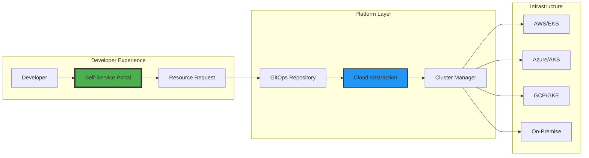
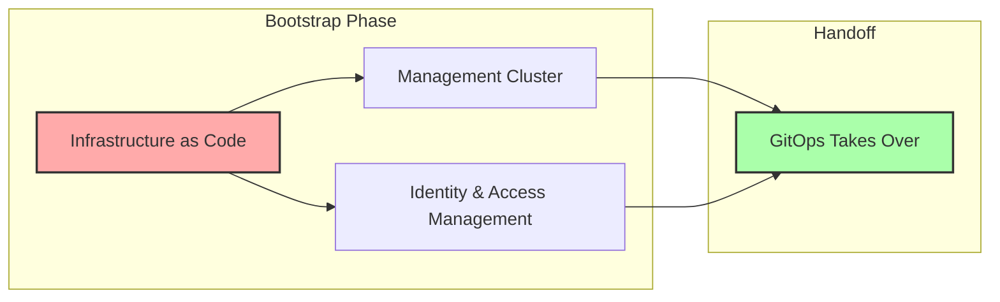
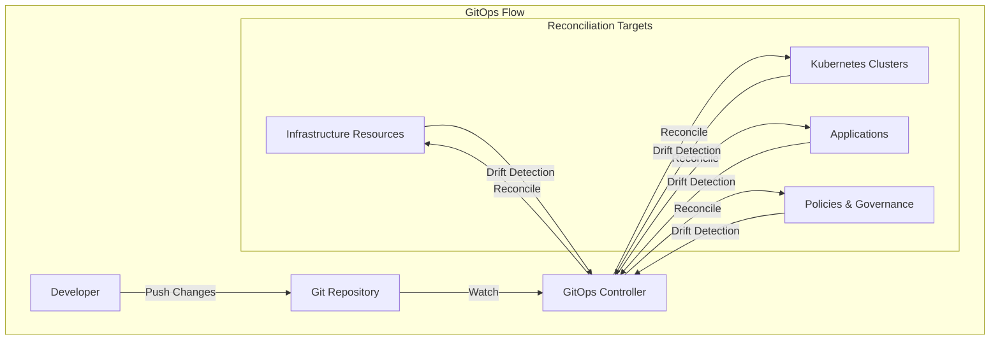
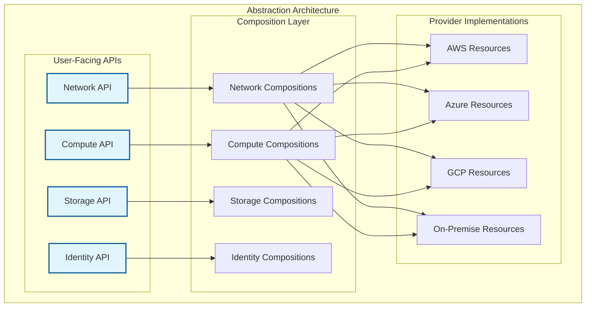
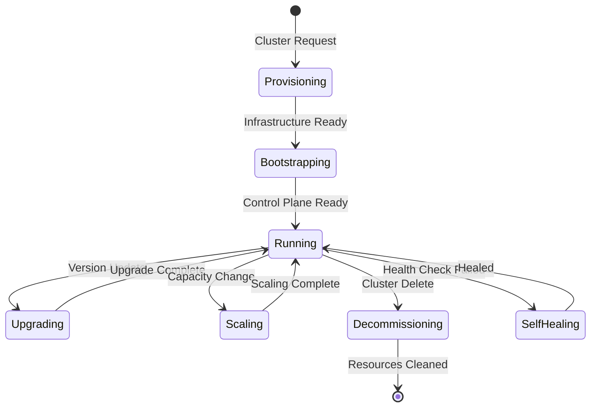
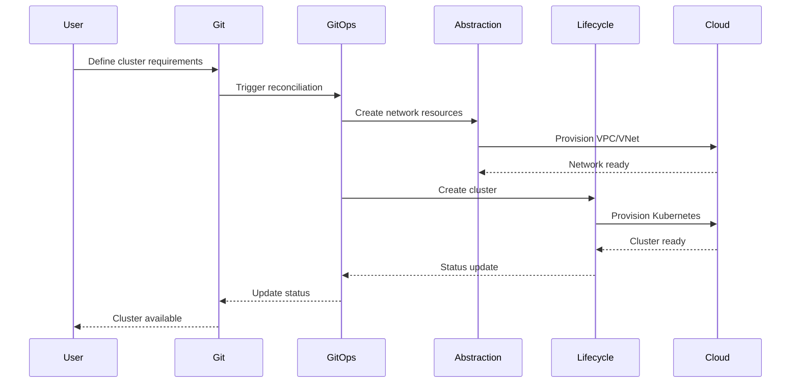
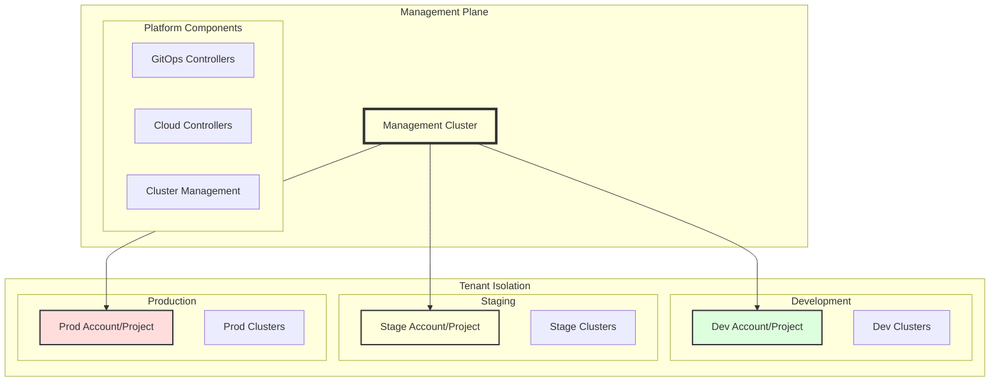
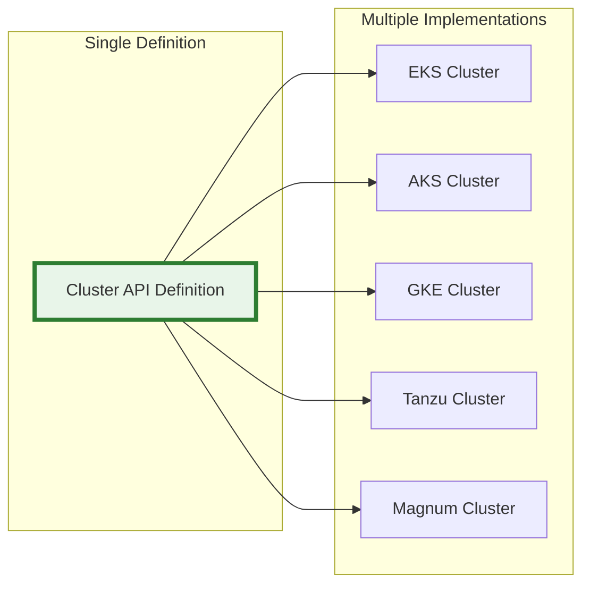

+++
title = "The Hyperscalar Kubernetes Pattern: Empowering Platform Engineers to Build Developer-First Infrastructure"
description = ""
date = 2025-05-11
author = {name = "Curtis Goolsby", email = "curtis@kubepros.dev"}
tags = []
draft = false
+++

# The Hyperscalar Kubernetes Pattern: Empowering Platform Engineers to Build Developer-First Infrastructure

As a platform engineer, you've likely faced the eternal struggle: developers need infrastructure quickly and easily, but you need to maintain control, security, and cost management across multiple cloud providers. The Hyperscalar Kubernetes pattern offers a powerful solution by creating a unified developer experience that abstracts away cloud complexity while giving you the control and flexibility you need.

## The Platform Engineer's Dream: One Interface, Any Cloud

Imagine providing your developers with a simple web interface where they can request a Kubernetes cluster, and within minutes, it's provisioned in AWS, Azure, GCP, or your on-premise infrastructure—without them knowing or caring about the underlying complexity. That's the power of the Hyperscalar pattern.

## The Four Pillars of Hyperscalar Architecture

### 1. Bootstrap Layer: The Minimal Foundation

The first principle of the Hyperscalar pattern is to minimize the bootstrapping footprint. Rather than building complex infrastructure provisioning systems, we create only what's absolutely necessary: a single management cluster that will host our platform components.

Key principles:
- **One-time execution**: Bootstrap runs once, then hands off control
- **Minimal scope**: Only creates the management cluster and authentication
- **Cloud-agnostic**: Can use any IaC tool (Terraform, Pulumi, CloudFormation)
- **Stateless handoff**: All subsequent operations happen through Kubernetes APIs

### 2. GitOps Layer: The Continuous Reconciliation Engine

Once bootstrapped, the GitOps layer becomes the heart of the system. Every change, from infrastructure provisioning to application deployment, flows through Git and is automatically reconciled to the desired state.

GitOps principles in action:
- **Declarative everything**: All resources defined as manifests
- **Automated reconciliation**: Continuous drift detection and correction
- **Version control**: Complete audit trail and rollback capability
- **Pull-based deployment**: Enhanced security model

### 3. Cloud Abstraction Layer: The Universal Interface

The cloud abstraction layer is where the Hyperscalar pattern truly shines. Instead of writing cloud-specific infrastructure code, teams define their needs using cloud-agnostic APIs that are implemented by provider-specific compositions.

This abstraction enables:
- **Cloud portability**: Same API across all providers
- **Simplified operations**: Teams learn one API, use everywhere
- **Vendor flexibility**: Easy to add new providers or switch
- **Cost optimization**: Deploy to the most cost-effective option

### 4. Cluster Lifecycle Layer: Kubernetes as a Service

The final pillar manages the lifecycle of Kubernetes clusters themselves. By treating clusters as cattle rather than pets, the pattern enables dynamic cluster provisioning, scaling, and decommissioning.

Cluster lifecycle features:
- **Declarative provisioning**: Clusters defined as Kubernetes resources
- **Automated upgrades**: Rolling updates with zero downtime
- **Self-healing**: Automatic recovery from failures
- **Dynamic scaling**: Respond to workload demands

## The Power of Composition

One of the most elegant aspects of the Hyperscalar pattern is how these layers compose together to create powerful workflows:

## Multi-Tenancy and Account Isolation

The Hyperscalar pattern naturally supports multi-tenancy through account/project isolation:

Benefits of account isolation:
- **Security boundaries**: Complete isolation between environments
- **Cost attribution**: Clear visibility into spending
- **Compliance**: Easier to meet regulatory requirements
- **Blast radius limitation**: Issues contained to single account

## Extensibility: The Multi-Cloud Journey

The true power of the Hyperscalar pattern emerges when extending to multiple clouds:

The same pattern extends to:
- **Networking**: Abstract VPCs/VNets/Networks
- **Storage**: Abstract block/object storage
- **Identity**: Abstract IAM/RBAC across clouds
- **Compute**: Abstract VMs/instances

## Operational Excellence Through Patterns

The Hyperscalar pattern promotes operational excellence through:

### Self-Service Operations
- Developers request resources through Git
- Automated provisioning without tickets
- Clear approval workflows via pull requests

### Continuous Compliance
- All changes tracked in version control
- Automated policy enforcement
- Drift detection and remediation

### Disaster Recovery
- Infrastructure as code in Git
- Point-in-time recovery via Git history
- Cross-region/cross-cloud failover capability

### Cost Optimization
- Easy cluster lifecycle management
- Automated resource cleanup
- Multi-cloud cost arbitrage

## Implementation Strategy

Adopting the Hyperscalar pattern doesn't require a big-bang approach:

```mermaid
graph LR
    subgraph "Phase 1"
        Bootstrap[Bootstrap Management]
        GitOps[Enable GitOps]
    end
    
    subgraph "Phase 2"
        Abstract[Add Abstractions]
        FirstCluster[First Workload Cluster]
    end
    
    subgraph "Phase 3"
        MultiAccount[Multi-Account]
        SelfService[Self-Service Portal]
    end
    
    subgraph "Phase 4"
        MultiCloud[Multi-Cloud]
        Advanced[Advanced Workflows]
    end
    
    Bootstrap --> GitOps
    GitOps --> Abstract
    Abstract --> FirstCluster
    FirstCluster --> MultiAccount
    MultiAccount --> SelfService
    SelfService --> MultiCloud
    MultiCloud --> Advanced
    
    style Bootstrap fill:#e3f2fd,stroke:#1976d2,stroke-width:2px
    style MultiCloud fill:#fce4ec,stroke:#c2185b,stroke-width:2px
```

## Conclusion: A Pattern for the Future

The Hyperscalar Kubernetes pattern represents a fundamental shift in how we think about platform engineering. By combining:

- **Minimal bootstrapping** for simplicity
- **GitOps** for continuous operations
- **Cloud abstractions** for portability
- **Declarative lifecycle management** for scale

We create platforms that are not just technically superior but organizationally transformative. This pattern enables teams to:

- Move faster with self-service capabilities
- Operate more reliably with GitOps automation
- Adapt quickly to changing requirements
- Scale efficiently across clouds and regions

As organizations continue their cloud-native journey, the need for patterns that provide both structure and flexibility becomes paramount. The Hyperscalar pattern offers a proven approach that scales from startup to enterprise, from single cloud to multi-cloud, from simple to complex.

The future of platform engineering isn't about choosing the right cloud or the right tool—it's about choosing the right patterns. The Hyperscalar pattern shows us that with thoughtful architecture, we can build platforms that grow with our organizations rather than constraining them.

---

*The Hyperscalar pattern is more than technology—it's a philosophy of platform engineering that puts abstraction, automation, and adaptability at its core. How might this pattern transform your organization's approach to Kubernetes?*
