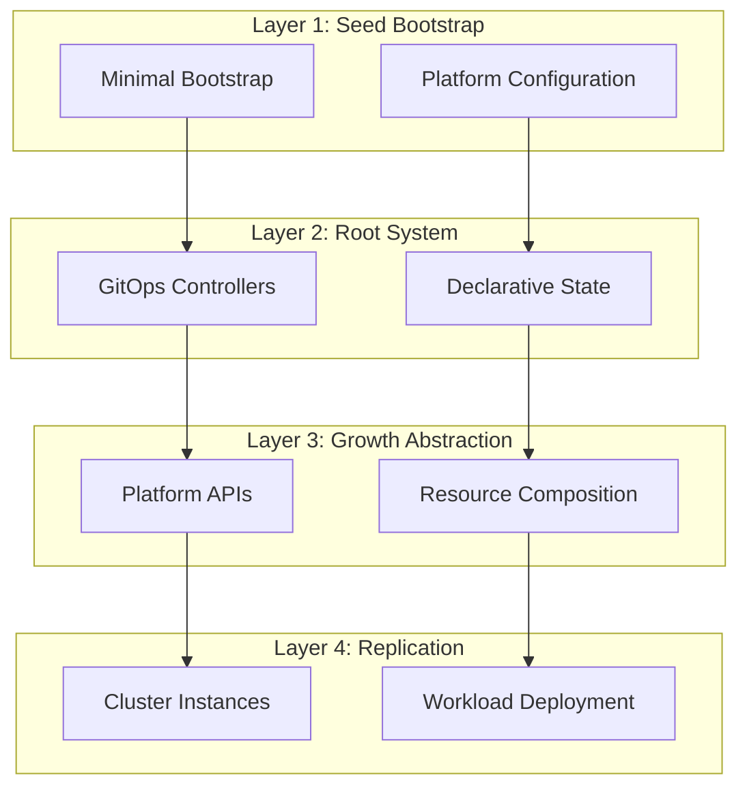
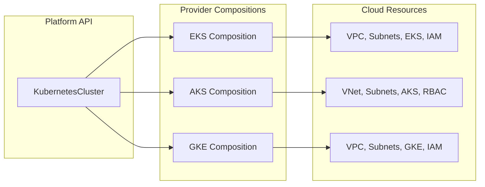
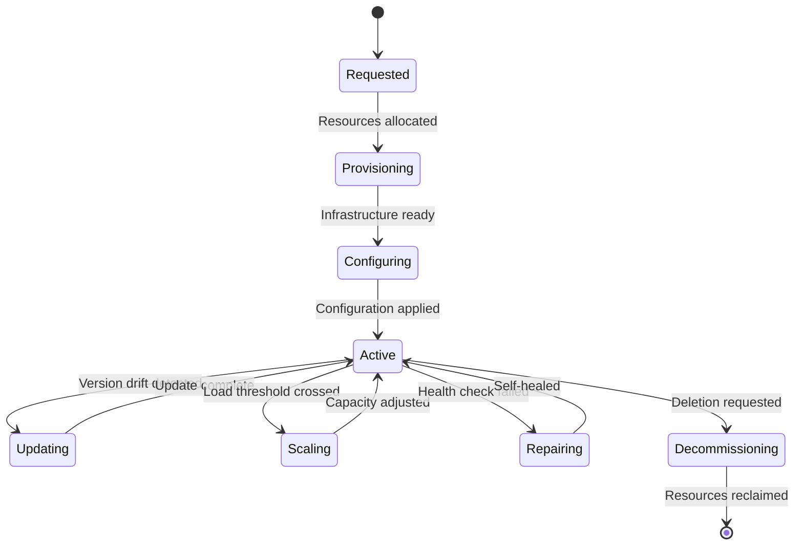
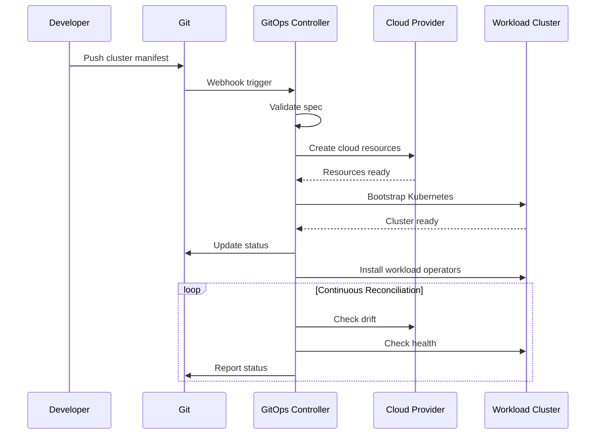
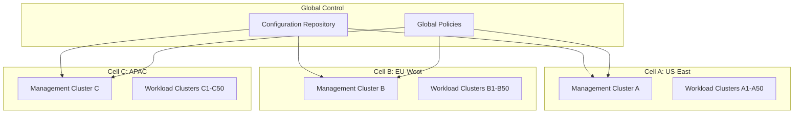
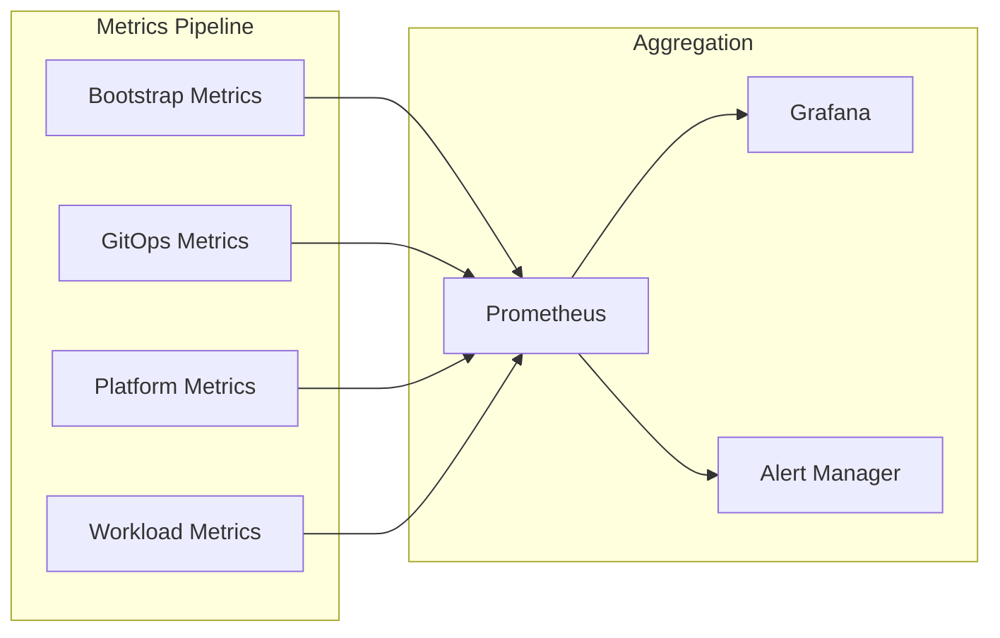

+++
title = "The Seed Pattern: Building Self-Propagating Kubernetes Infrastructure at Scale"
description = "A systematic approach to platform engineering that transforms manual infrastructure provisioning into self-managing, multi-cloud systems through minimal bootstrap and maximum automation"
date = 2025-05-11
author = {name = "Curtis Goolsby", email = "curtis@kubepros.dev"}
tags = ["kubernetes", "platform-engineering", "gitops", "infrastructure-patterns", "cloud-native"]
draft = false
+++

# The Seed Pattern: Building Self-Propagating Kubernetes Infrastructure at Scale

Platform engineering teams face a fundamental challenge: how do you scale infrastructure provisioning across multiple clouds, accounts, and teams without proportionally scaling your team? The traditional approach—treating each cluster as a unique snowflake requiring manual setup—breaks down quickly under real-world demands.

The Seed Pattern offers a different approach. Like biological systems that grow from minimal genetic material into complex organisms, this pattern starts with a minimal bootstrap "seed" that contains everything needed to grow into a full platform. Once planted, the system self-propagates, self-heals, and evolves without constant manual intervention.

## Core Architecture: From Seed to System

The pattern operates on four interconnected layers, each building on the previous to create a self-sustaining platform:



### Layer 1: The Bootstrap Seed

The seed contains only the minimum viable infrastructure needed to bootstrap the platform. This typically includes:

- A single management cluster
- Identity and access management primitives  
- GitOps controller installation
- Initial platform configuration

Key principle: The seed runs exactly once. After initial planting, all subsequent operations happen through the platform itself.

```yaml
# Example seed configuration
apiVersion: seed.platform.io/v1
kind: Bootstrap
metadata:
  name: platform-seed
spec:
  managementCluster:
    provider: eks
    version: "1.28"
    region: us-east-1
  gitops:
    system: flux
    repository: github.com/org/platform-config
  identity:
    provider: aws-iam
    oidc:
      enabled: true
```

### Layer 2: The GitOps Root System

Once bootstrapped, GitOps becomes the root system—the only mechanism for platform changes. This creates several critical properties:

- **Immutable history**: Every change tracked in Git
- **Declarative convergence**: Actual state continuously reconciled to desired state
- **Distributed coordination**: Multiple controllers working from single source of truth

The root system extends beyond simple application deployment to manage:
- Cloud provider resources (via Crossplane or similar)
- Kubernetes cluster lifecycle
- Policy and governance rules
- Platform configuration itself

### Layer 3: Growth Through Abstraction

The abstraction layer is where the pattern delivers its primary value. Instead of exposing cloud-specific APIs, teams interact with platform-native resources:

```yaml
# Platform-native cluster definition
apiVersion: platform.io/v1
kind: KubernetesCluster
metadata:
  name: prod-app-cluster
  namespace: production
spec:
  purpose: application-workload
  size: large
  highAvailability: true
  networking:
    model: private
    cidr: auto
  compliance:
    standards: ["pci-dss", "soc2"]
```

The platform translates this into provider-specific implementations:



### Layer 4: Self-Replication and Lifecycle

The final layer handles the complete lifecycle of infrastructure components. Clusters aren't just created—they're continuously managed:



## Implementation Deep Dive

### Minimal Bootstrap Philosophy

The seed bootstrap deliberately does as little as possible. This isn't just minimalism for its own sake—it's a critical design principle that enables:

1. **Reproducibility**: Minimal seeds are easier to replicate across environments
2. **Auditability**: Less bootstrap code means clearer security boundaries
3. **Maintainability**: Fewer moving parts in the critical path
4. **Portability**: Simpler to adapt to new providers

Example bootstrap sequence:

```bash
# Total bootstrap: ~100 lines of code
terraform apply -auto-approve
kubectl apply -f https://platform.io/bootstrap/gitops.yaml
kubectl create secret generic git-credentials --from-file=ssh-privatekey
kubectl apply -f bootstrap-config.yaml
# Bootstrap complete - everything else happens through GitOps
```

### GitOps as Universal Control Plane

Traditional infrastructure tools create a divide between initial provisioning (Day 0) and ongoing operations (Day 2). The Seed Pattern eliminates this divide by making GitOps the universal control plane from the moment of bootstrap.

This enables powerful workflows:



### Abstraction Without Obfuscation

The abstraction layer provides simplicity without hiding necessary complexity. Teams can:

1. Use high-level APIs for common cases
2. Override specific provider settings when needed
3. Access raw provider resources for edge cases

```yaml
apiVersion: platform.io/v1
kind: KubernetesCluster
metadata:
  name: specialized-cluster
spec:
  # High-level abstraction
  size: large
  
  # Provider-specific overrides
  providerOverrides:
    eks:
      nodeGroups:
        - instanceTypes: ["m5.xlarge", "m5.2xlarge"]
          spotEnabled: true
          spotAllocationStrategy: "capacity-optimized"
      addons:
        - name: "aws-ebs-csi-driver"
          version: "latest"
```

### Multi-Cloud Through Composition

The pattern achieves true multi-cloud capability through composition rather than abstraction. Each provider implementation is a composition of native resources:

```yaml
# EKS Composition (simplified)
apiVersion: apiextensions.crossplane.io/v1
kind: Composition
metadata:
  name: eks-cluster
spec:
  compositeTypeRef:
    apiVersion: platform.io/v1
    kind: KubernetesCluster
    
  resources:
    - name: vpc
      base:
        apiVersion: ec2.aws.crossplane.io/v1beta1
        kind: VPC
      patches:
        - fromFieldPath: "spec.networking.cidr"
          toFieldPath: "spec.forProvider.cidrBlock"
          
    - name: cluster
      base:
        apiVersion: eks.aws.crossplane.io/v1beta1
        kind: Cluster
      patches:
        - fromFieldPath: "spec.version"
          toFieldPath: "spec.forProvider.version"
```

## Advanced Patterns

### Cellular Architecture

Large deployments benefit from cellular architecture—independent platform cells that share configuration but operate autonomously:



### Progressive Delivery for Infrastructure

Apply progressive delivery principles to infrastructure changes:

```yaml
apiVersion: flagger.app/v1beta1
kind: Canary
metadata:
  name: cluster-upgrade
spec:
  targetRef:
    apiVersion: platform.io/v1
    kind: KubernetesCluster
    name: prod-cluster
  
  progressDeadlineSeconds: 3600
  
  analysis:
    interval: 5m
    threshold: 5
    maxWeight: 100
    stepWeight: 20
    
    metrics:
    - name: cluster-health
      thresholdRange:
        min: 99
    - name: workload-readiness
      thresholdRange:
        min: 95
```

### Policy as Code Integration

Embed policy enforcement directly into the growth pattern:

```yaml
apiVersion: kyverno.io/v1
kind: ClusterPolicy
metadata:
  name: require-ha-production
spec:
  validationFailureAction: enforce
  background: false
  rules:
    - name: require-high-availability
      match:
        any:
        - resources:
            kinds:
            - platform.io/v1/KubernetesCluster
            namespaces:
            - "production"
      validate:
        message: "Production clusters must have HA enabled"
        pattern:
          spec:
            highAvailability: true
```

## Operational Excellence

### Observability From the Root

The pattern embeds observability at every layer:



Key metrics to track:
- Time from commit to cluster ready
- Drift detection and correction frequency
- Resource utilization efficiency
- Cross-cloud cost optimization
- Policy compliance percentage

### Disaster Recovery Through Reseeding

The pattern's Git-centric approach enables sophisticated DR strategies:

1. **Point-in-time recovery**: Revert Git to any previous state
2. **Cross-region replication**: Seed new regions from existing configuration
3. **Provider migration**: Switch clouds by changing composition targets

```bash
# Complete platform recovery
git checkout <known-good-sha>
terraform apply  # Recreate seed
kubectl apply -f bootstrap.yaml  # Replant
# Platform rebuilds itself from Git
```

## Real-World Implementation

### Phase 1: Seed Establishment (Days 1-7)
- Create minimal bootstrap code
- Establish Git repository structure
- Deploy management cluster
- Install GitOps controllers

### Phase 2: Root Development (Days 8-21)
- Define platform APIs
- Create first provider composition
- Implement cluster lifecycle controller
- Establish monitoring

### Phase 3: First Growth (Days 22-30)
- Deploy first workload cluster via GitOps
- Validate end-to-end flow
- Implement basic policies
- Create developer documentation

### Phase 4: Replication (Month 2+)
- Add additional provider compositions
- Implement multi-tenancy
- Scale to production workloads
- Optimize for performance

## Conclusion

The Seed Pattern represents a fundamental shift in platform engineering philosophy. Rather than building elaborate infrastructure provisioning systems, we plant minimal seeds that grow into self-managing platforms. This approach delivers:

- **Scalability**: Manage thousands of clusters with small teams
- **Reliability**: Self-healing from the ground up
- **Flexibility**: Easy adaptation to new requirements
- **Efficiency**: Minimal operational overhead

Most importantly, it transforms platform teams from infrastructure operators into platform architects, focusing on patterns and automation rather than manual processes.

The pattern has been successfully implemented across industries, from startups managing dozens of clusters to enterprises operating thousands. In each case, the core principle remains: start small, encode your platform DNA, and let the system grow itself.

---

*Ready to implement the Seed Pattern? Start with the bootstrap, establish your root system, and watch your platform grow.*