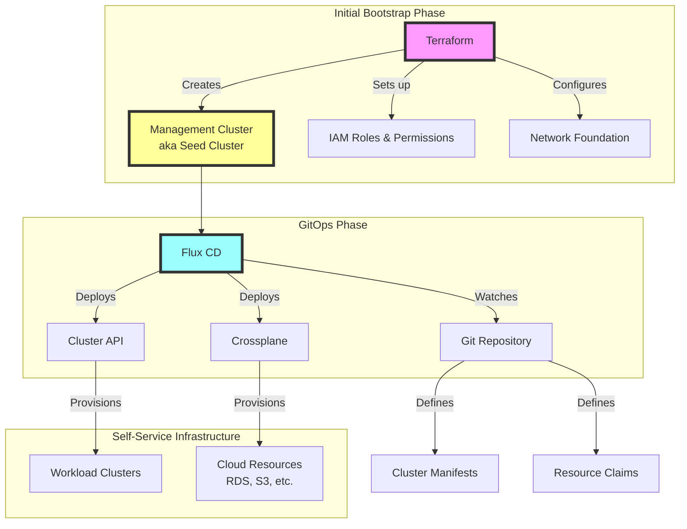
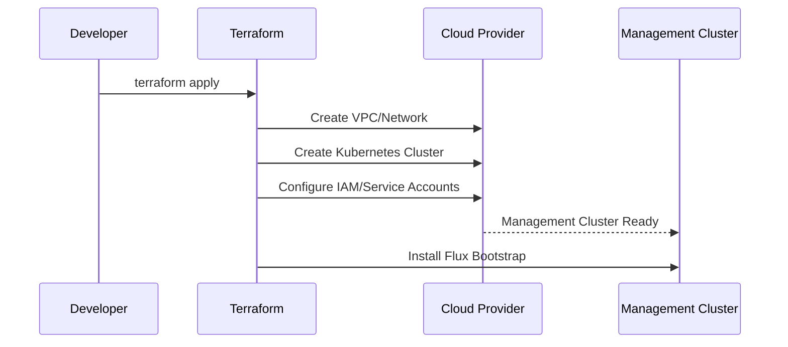
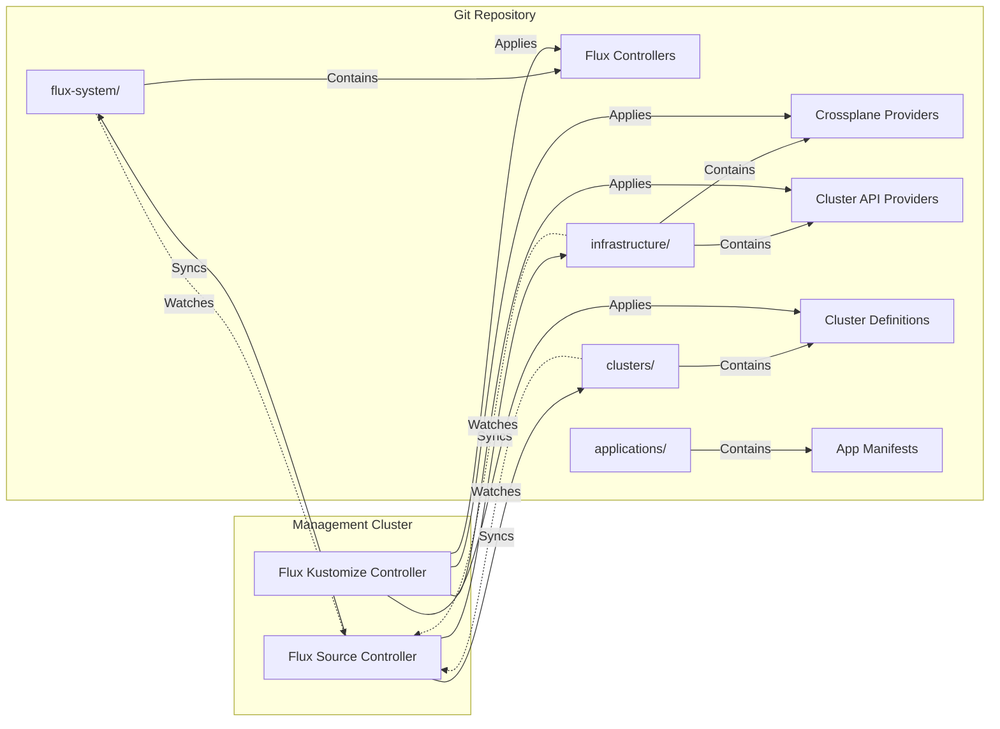
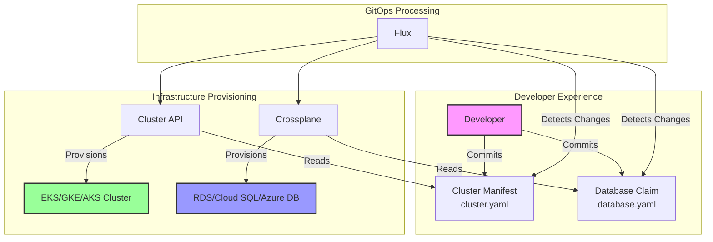
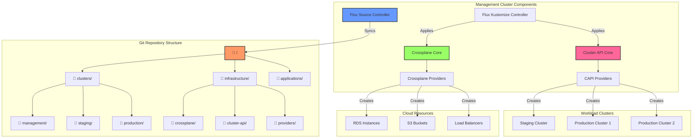
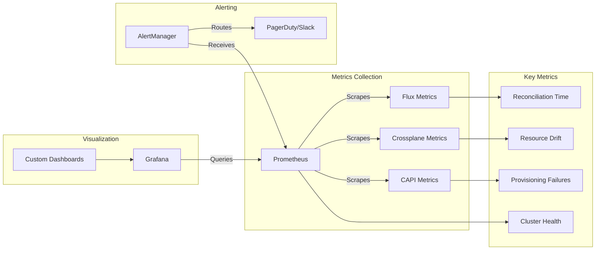

## Introduction

In today's multi-cloud world, organizations need infrastructure patterns that work across cloud providers while maintaining consistency and automation. This post explores a powerful cloud-agnostic pattern that combines Terraform's initial bootstrapping capabilities with GitOps principles for ongoing infrastructure management.

The pattern creates a self-provisioning infrastructure platform that can spawn and manage Kubernetes clusters and cloud resources across any provider, all controlled through Git repositories.

## Architecture Overview



## The Pattern Explained

### Phase 1: Terraform Bootstrap

The journey begins with Terraform creating the foundation:

1. **Management Cluster (Seed)**: A Kubernetes cluster that will host all infrastructure management tools
2. **IAM/RBAC Configuration**: Cloud provider permissions allowing the cluster to create resources
3. **Network Foundation**: VPCs, subnets, and basic networking required for the management plane



### Phase 2: GitOps Takes Over

Once the management cluster is running, Flux CD bootstraps the GitOps workflow:



### Phase 3: Self-Service Infrastructure

With Cluster API and Crossplane installed, teams can now provision infrastructure declaratively:



## Implementation Example

### Step 1: Terraform Configuration

```hcl
# main.tf
module "management_cluster" {
  source = "./modules/eks"  # or gke, aks
  
  cluster_name = "management-seed"
  cluster_version = "1.28"
  
  # Enable IRSA/Workload Identity for Crossplane & CAPI
  enable_irsa = true
  
  # Addons for GitOps
  enable_flux = true
  flux_github_owner = var.github_owner
  flux_github_repo = var.github_repo
}

# IAM for Crossplane to manage AWS resources
module "crossplane_irsa" {
  source = "./modules/irsa"
  
  service_account_name = "crossplane-provider-aws"
  namespace = "crossplane-system"
  cluster_oidc_issuer_url = module.management_cluster.oidc_issuer_url
  
  # Permissions for Crossplane to create any AWS resource
  policy_arns = ["arn:aws:iam::aws:policy/AdministratorAccess"]
}

# IAM for Cluster API to manage EKS clusters
module "capi_irsa" {
  source = "./modules/irsa"
  
  service_account_name = "capa-controller-manager"
  namespace = "capa-system"
  cluster_oidc_issuer_url = module.management_cluster.oidc_issuer_url
  
  # Permissions for CAPI to create EKS clusters
  policy_arns = [aws_iam_policy.capi_eks.arn]
}
```

### Step 2: Flux Configuration

```yaml
# clusters/management/flux-system/gotk-sync.yaml
apiVersion: source.toolkit.fluxcd.io/v1
kind: GitRepository
metadata:
  name: flux-system
  namespace: flux-system
spec:
  interval: 1m0s
  ref:
    branch: main
  url: https://github.com/${github_owner}/${github_repo}
---
apiVersion: kustomize.toolkit.fluxcd.io/v1
kind: Kustomization
metadata:
  name: flux-system
  namespace: flux-system
spec:
  interval: 10m0s
  path: ./clusters/management
  prune: true
  sourceRef:
    kind: GitRepository
    name: flux-system
---
# Infrastructure components
apiVersion: kustomize.toolkit.fluxcd.io/v1
kind: Kustomization
metadata:
  name: infrastructure
  namespace: flux-system
spec:
  interval: 10m0s
  path: ./infrastructure
  prune: true
  sourceRef:
    kind: GitRepository
    name: flux-system
  dependsOn:
    - name: flux-system
```

### Step 3: Crossplane & Cluster API Installation

```yaml
# infrastructure/crossplane/release.yaml
apiVersion: v1
kind: Namespace
metadata:
  name: crossplane-system
---
apiVersion: source.toolkit.fluxcd.io/v1beta2
kind: HelmRepository
metadata:
  name: crossplane-stable
  namespace: flux-system
spec:
  interval: 12h
  url: https://charts.crossplane.io/stable
---
apiVersion: helm.toolkit.fluxcd.io/v2beta1
kind: HelmRelease
metadata:
  name: crossplane
  namespace: flux-system
spec:
  interval: 1h
  chart:
    spec:
      chart: crossplane
      version: "1.14.x"
      sourceRef:
        kind: HelmRepository
        name: crossplane-stable
  targetNamespace: crossplane-system
  install:
    createNamespace: true
  values:
    provider:
      packages:
        - xpkg.upbound.io/crossplane-contrib/provider-aws:v0.45.0
        - xpkg.upbound.io/crossplane-contrib/provider-kubernetes:v0.9.0
```

```yaml
# infrastructure/cluster-api/release.yaml
apiVersion: v1
kind: Namespace
metadata:
  name: capi-system
---
apiVersion: source.toolkit.fluxcd.io/v1beta2
kind: GitRepository
metadata:
  name: cluster-api
  namespace: flux-system
spec:
  interval: 30m
  url: https://github.com/kubernetes-sigs/cluster-api
  ref:
    tag: v1.6.0
---
apiVersion: kustomize.toolkit.fluxcd.io/v1
kind: Kustomization
metadata:
  name: cluster-api
  namespace: flux-system
spec:
  interval: 30m
  path: ./config/default
  prune: true
  sourceRef:
    kind: GitRepository
    name: cluster-api
  patches:
    - patch: |
        - op: add
          path: /spec/template/spec/containers/0/env/-
          value:
            name: AWS_REGION
            value: us-west-2
      target:
        kind: Deployment
        name: capa-controller-manager
```

### Step 4: Self-Service Usage

Now teams can create clusters and resources through Git:

```yaml
# clusters/production/cluster.yaml
apiVersion: cluster.x-k8s.io/v1beta1
kind: Cluster
metadata:
  name: production-workload-1
  namespace: default
spec:
  clusterNetwork:
    pods:
      cidrBlocks:
      - 10.120.0.0/16
    services:
      cidrBlocks:
      - 10.121.0.0/16
  controlPlaneRef:
    apiVersion: controlplane.cluster.x-k8s.io/v1beta2
    kind: AWSManagedControlPlane
    name: production-workload-1-control-plane
  infrastructureRef:
    apiVersion: infrastructure.cluster.x-k8s.io/v1beta2
    kind: AWSManagedCluster
    name: production-workload-1
```

```yaml
# applications/production/database.yaml
apiVersion: database.crossplane.io/v1alpha1
kind: PostgreSQLInstance
metadata:
  name: app-database
  namespace: production
spec:
  parameters:
    engine: postgres
    engineVersion: "15"
    instanceClass: db.t3.medium
    storageGB: 100
  compositionSelector:
    matchLabels:
      provider: aws
      complexity: production
  writeConnectionSecretToRef:
    name: app-database-conn
    namespace: production
```

## Benefits of This Pattern

### 1. Cloud Agnostic
- Works with any cloud provider that has Crossplane providers and Cluster API implementations
- Same workflow whether using AWS, GCP, Azure, or on-premises

### 2. GitOps Native
- All infrastructure defined as code in Git
- Full audit trail and rollback capabilities
- Pull request workflow for infrastructure changes

### 3. Self-Service
- Development teams can provision their own infrastructure
- Platform team defines guardrails through Crossplane compositions
- No direct cloud console access needed

### 4. Scalable
- Management cluster can handle hundreds of workload clusters
- Resources are managed declaratively and reconciled automatically
- Horizontal scaling through multiple management clusters if needed

## Architecture Deep Dive: Component Interactions



## Security Considerations

### 1. Least Privilege Access
- Each component gets only the permissions it needs
- Crossplane providers use IRSA/Workload Identity
- Cluster API uses scoped IAM roles

### 2. Network Isolation
- Management cluster in isolated VPC
- Private endpoints for API servers
- Network policies for pod-to-pod communication

### 3. GitOps Security
- Signed commits required
- Branch protection rules
- Automated security scanning in CI/CD

## Monitoring and Observability



## Common Pitfalls and Solutions

### 1. Permission Scope Creep
**Problem**: Giving too broad permissions to service accounts
**Solution**: Use policy generators and regularly audit permissions

### 2. Git Repository Sprawl
**Problem**: Too many repositories making it hard to manage
**Solution**: Use a monorepo approach with clear directory structures

### 3. Reconciliation Loops
**Problem**: Resources constantly being updated due to drift
**Solution**: Proper ignore rules and field managers

## Conclusion

This cloud-agnostic pattern provides a powerful foundation for modern infrastructure management. By combining Terraform's bootstrapping capabilities with GitOps principles and cloud-native tools like Crossplane and Cluster API, organizations can achieve:

- Consistent infrastructure provisioning across clouds
- Developer self-service without compromising security
- Full auditability and compliance through Git
- Scalable management of hundreds of clusters and thousands of resources

The initial investment in setting up this pattern pays dividends through reduced operational overhead, faster time-to-market for new services, and improved reliability through infrastructure-as-code practices.

## Next Steps

1. Start with a proof-of-concept in a development environment
2. Define your Crossplane compositions for common use cases
3. Create Cluster API templates for your standard cluster configurations
4. Implement proper RBAC and admission controllers
5. Set up monitoring and alerting for the management cluster
6. Document workflows and create self-service guides for developers

The future of infrastructure is declarative, GitOps-driven, and cloud-agnostic. This pattern provides a solid foundation for that future.
