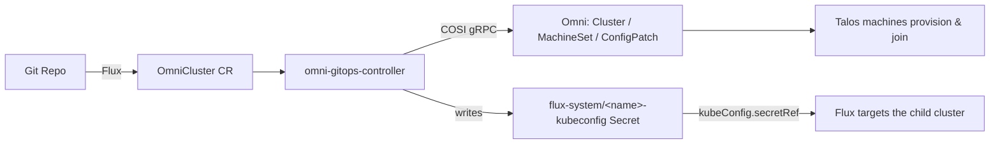

+++
title = "GitOps-Native Talos Clusters on Omni"
description = "Self-hosted Omni is declarative, but there was no Kubernetes-native way to provision Talos clusters and hand their kubeconfigs to Flux. So I built one: one operator, one CRD."
date = 2026-08-20
author = {name = "Curtis Goolsby", email = "cvioling@gmail.com"}
tags = ["kubernetes", "talos", "omni", "siderolabs", "flux", "gitops", "operator"]
+++

If you run [self-hosted Omni](https://omni.siderolabs.com), you already have a
declarative control plane for Talos. But there's a gap that bites the moment you go
all-in on GitOps: there's no Kubernetes-native way to say *"here's the cluster I
want"* in Git and have it provisioned through Omni **and** have its kubeconfig land
where Flux can use it. You click through the UI, or you write glue. Neither is
reproducible from a repo.

As far as I can find, nobody has published an operator that closes this loop. Omni
has its own templates; Flux and Argo can *target* Omni clusters once they exist. But
wrapping Omni *provisioning* in a custom resource — that didn't exist. So I wrote
[`omni-gitops-controller`](https://github.com/cgoolsby/omni-gitops-controller).

## One CRD, reconciled into Omni

You declare a cluster in Git and Flux applies it to a small **management cluster**
that runs the controller:

```yaml
apiVersion: omni.gitops.dev/v1alpha1
kind: OmniCluster
metadata:
  name: my-cluster
  namespace: omni-gitops-system
spec:
  kubernetesVersion: "1.31.0"
  talosVersion: "v1.9.0"
  controlPlane:
    replicas: 3
    machineSelector:                      # matched against Omni machine labels
      matchLabels: { omni.sidero.dev/mem: "65536" }   # 64 GiB boxes
  workers:
    - name: general
      replicas: 3
      machineSelector:
        matchLabels: { omni.sidero.dev/mem: "32768" }
```

From there the controller does the rest:



It calls Omni's native **COSI gRPC API** to create the cluster, allocates machines
from Omni's inventory by label selector, then writes the kubeconfig as a `Secret`
into `flux-system`. Flux picks it up with a `Kustomization` and starts deploying
workloads. No manual steps, no out-of-band credentials.

The controller keeps **no state of its own** — Omni stays authoritative, desired
state lives in the CR, runtime state in status. Kill the pod and it just resumes.

## Machines are Pods

The shape will look familiar: a top-level `OmniCluster` orchestrator creates,
updates, and deletes first-class `Machine` objects, each reconciled on its own.
That's **Deployment → ReplicaSet → Pod**, applied to bare metal. Each `Machine` is
named for its Omni UUID and owned by its cluster, so status changes flow back up
through a `.Owns` watch — event-driven, no polling — and machines are
garbage-collected on delete.

That split buys the thing I actually cared about: **safe rolling reboots**. One
reboot in flight cluster-wide, per-machine cooldown, quorum-safe control-plane
scale-down — and it needs almost no state. The orchestrator stamps a
`RebootRequestedAt`; the machine stamps `LastRebootTime` *after* the RPC returns. A
reboot is "owed" iff request is newer than last. Two timestamps, one comparison, no
flag to reset.

## Why not Cluster API?

Because CAPI-with-Talos uses `cluster-api-provider-talos`, which drives `talosctl`
directly and **bypasses Omni** — so Omni stops being the source of truth. I wanted
the opposite: Omni stays authoritative and this is a thin orchestration layer
speaking its protocol. One binary, one CRD, one `helm install`. If you need
portability across clouds, use CAPI. If Omni *is* your platform, this is a much
smaller thing to run.

It's Apache-2.0, cosign-signed with an SBOM, installable via Helm or Kustomize:
[**cgoolsby/omni-gitops-controller**](https://github.com/cgoolsby/omni-gitops-controller).
If you're running self-hosted Omni with GitOps, I'd like to hear how it fits.
