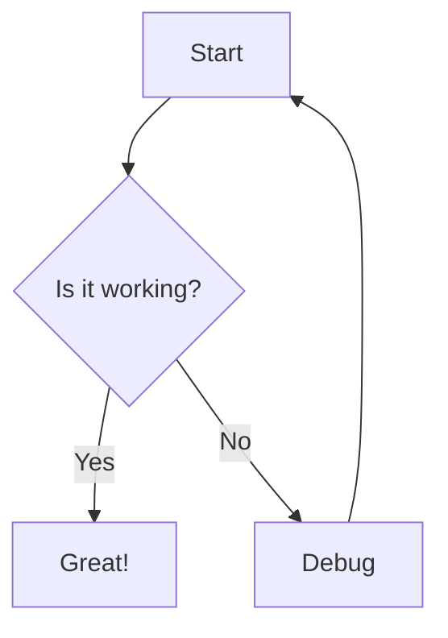
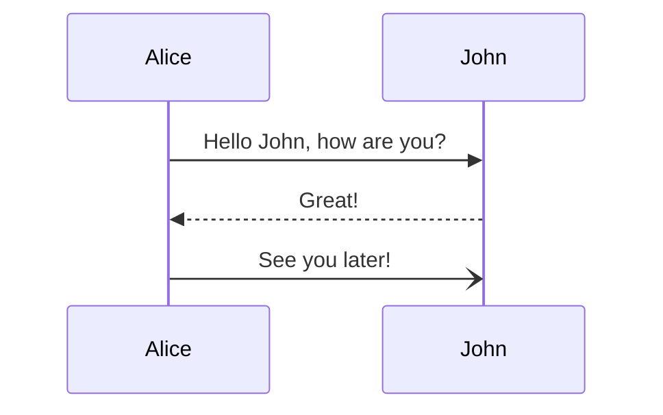
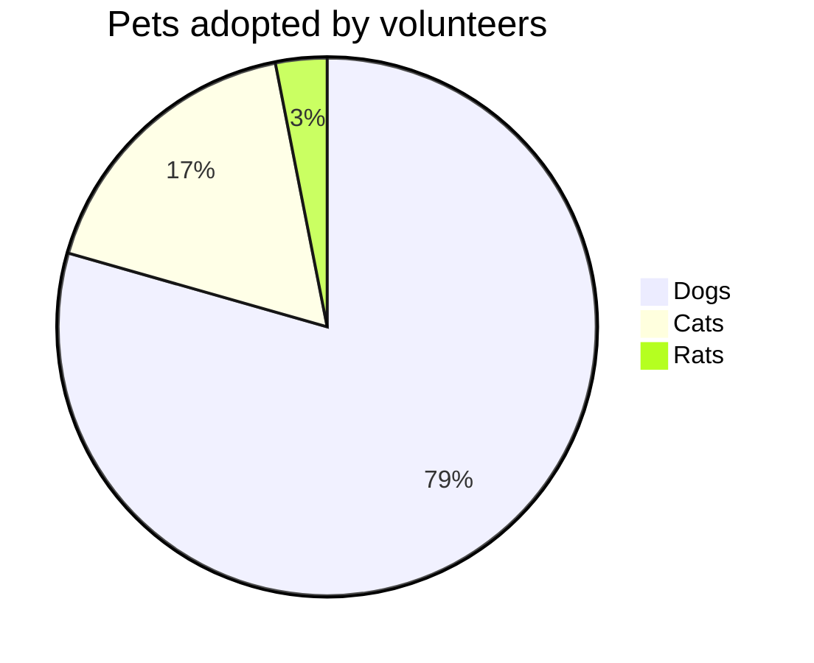

This is a test post to verify that Mermaid diagrams are working correctly.

## Using Code Blocks

Here's a simple flowchart using code blocks:

## Using Shortcode

Here's the same diagram using the mermaid shortcode:


graph TD
    A[Start] --> B{Is it working?}
    B -->|Yes| C[Great!]
    B -->|No| D[Debug]
    D --> A


## Sequence Diagram

## Pie Chart

